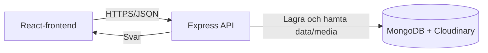
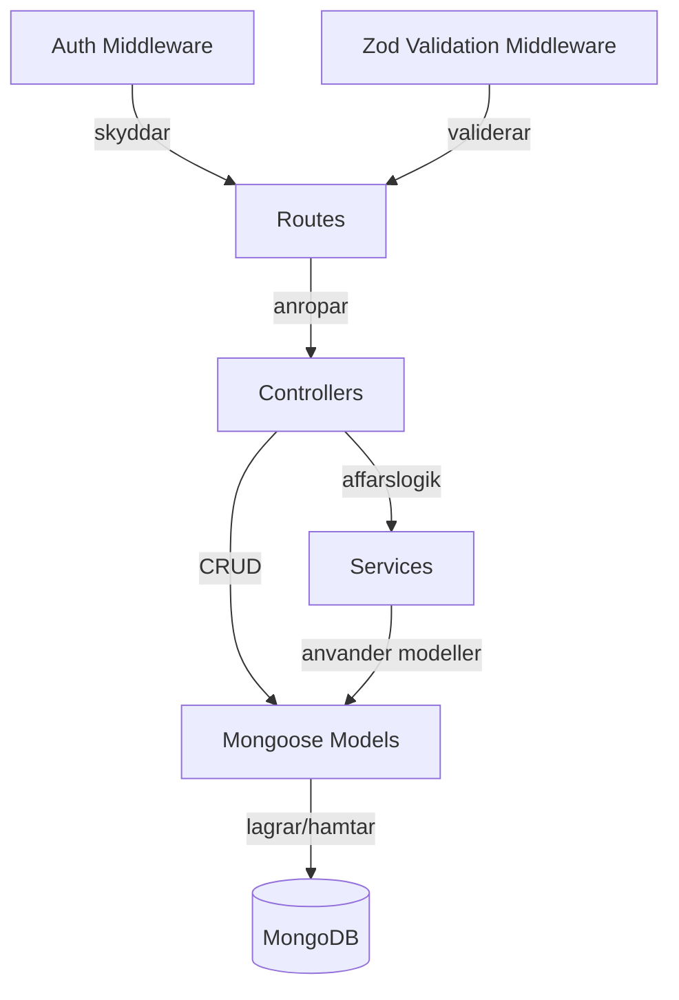
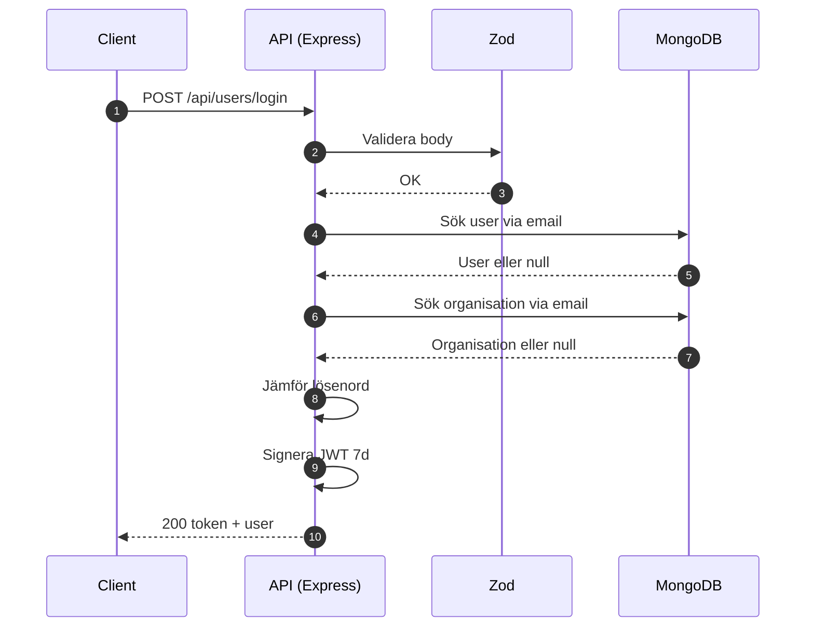
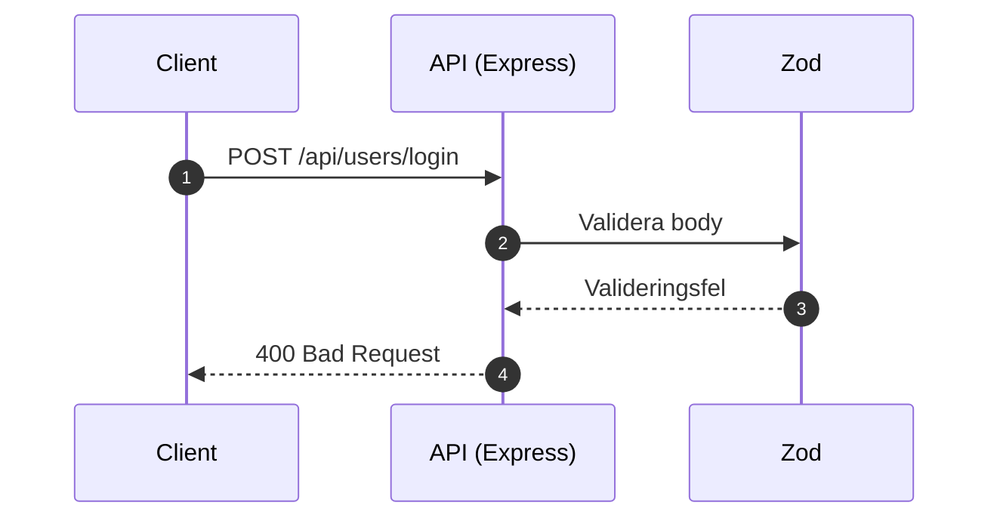
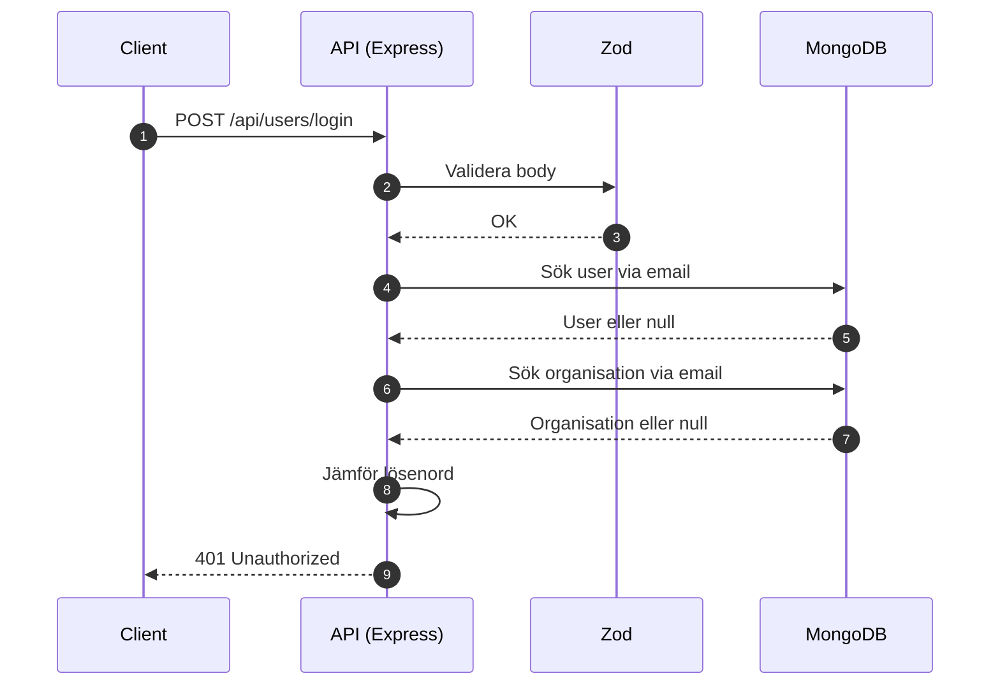
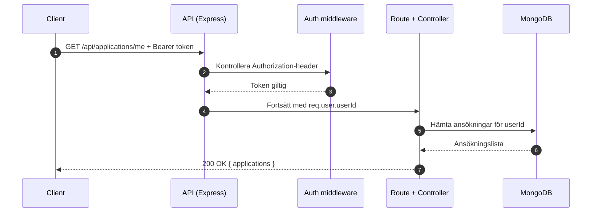
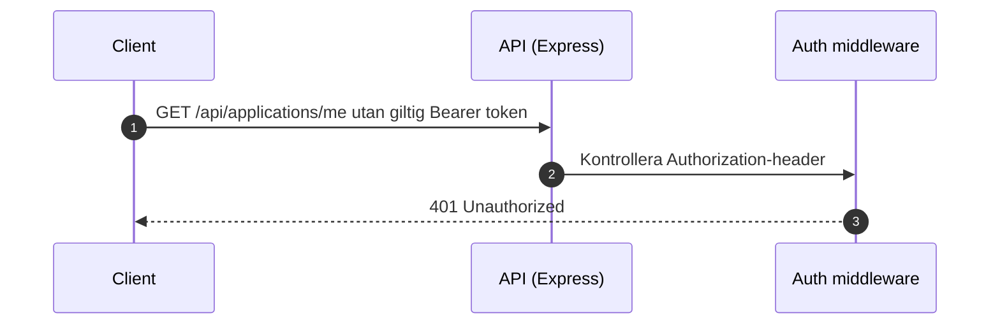

# Pawpals

Pawpals är en fullstack-applikation för djuradoption där adoptörer kan hitta djur och skicka ansökningar, medan organisationer och administratörer hanterar flödet. Projektet finns för att göra adoptionsprocessen tydligare, snabbare och mer spårbar för alla parter.

## Funktioner

- Utforska djur med sökning, filter och paginering.
- Se djurprofil med detaljer och skicka adoptionsansökan.
- Registrering och inloggning med rollerna adopter, organization och admin.
- Organisationsdashboard för att skapa, uppdatera och mjukradera djur.
- Hantering av inkomna ansökningar och statusuppdateringar.
- Notiser för nya ansökningar och statusförändringar.
- Adminfunktioner för att lista och ta bort användare/organisationer.

## Teknisk Stack

- Node.js 20+
- TypeScript
- React 19 + Vite
- Express 5
- MongoDB + Mongoose
- JWT-autentisering
- Zod-validering
- Multer + Cloudinary (bildhantering)
- Jest + Supertest (backendtester)

## Förutsättningar

- Node.js 20 eller senare
- npm
- MongoDB-databas (lokal eller MongoDB Atlas)
- Cloudinary-konto för uppladdning av bilder

## Installation

1. Klona repot.
2. Installera beroenden i projektroten:

```bash
npm install
```

3. Installera beroenden för serverdelen:

```bash
cd server
npm install
cd ..
```

4. Skapa en lokal .env-fil genom att utgå från .env.example.

```bash
cp .env.example .env
```

På Windows PowerShell:

```powershell
Copy-Item .env.example .env
```

## Miljövariabler

Projektet innehåller en versionerad mall i .env.example med alla nödvändiga variabler.

- Använd .env.example som mall och lägg riktiga värden i .env lokalt.
- .env ska aldrig committas (ignoreras via .gitignore).
- Använd aldrig exempelvärdena i produktion.

Skapa kryptografiskt starka hemligheter i produktion, till exempel:

```bash
node -e "console.log(require('crypto').randomBytes(64).toString('hex'))"
```

Skapa en .env-fil i projektroten om du kör backend via rotens script. Om du kör backend från server-mappen, se till att .env finns tillgänglig där.

| Variabel              | Syfte                                                         |
| --------------------- | ------------------------------------------------------------- |
| PORT                  | Port för backendservern (ex. 3000).                           |
| MONGODB_URI           | Anslutningssträng till MongoDB.                               |
| JWT_SECRET            | Hemlighet för signering/verifiering av JWT.                   |
| ADMIN_SECRET          | Hemlig nyckel som krävs för endpointen som skapar admin.      |
| CLOUDINARY_URL        | Komplett Cloudinary-URL (alternativ till separata variabler). |
| CLOUDINARY_CLOUD_NAME | Cloudinary cloud name (om CLOUDINARY_URL inte används).       |
| CLOUDINARY_API_KEY    | Cloudinary API-nyckel (om CLOUDINARY_URL inte används).       |
| CLOUDINARY_API_SECRET | Cloudinary API-hemlighet (om CLOUDINARY_URL inte används).    |

Se [.env.example](.env.example) för rekommenderade exempelvärden och format.

## Användning

Kör frontend i utvecklingsläge:

```bash
npm run dev
```

Kör backend i utvecklingsläge:

```bash
npm run dev:server
```

Bygg frontend för produktion:

```bash
npm run build
```

Förhandsvisa byggd frontend:

```bash
npm run preview
```

Kör backend i server-mappen:

```bash
cd server
npm run dev
```

Frontend kör normalt på http://localhost:5173 och backend på http://localhost:3000.

## API-dokumentation

Bas-URL lokalt:

- http://localhost:3000/api

Autentisering:

- Skyddade endpoints kräver headern Authorization: Bearer <jwt_token>
- JWT-token returneras från inloggningsendpoints

### Users

- POST /users/register
- POST /users/login
- GET /users/me (auth)
- PUT /users/preferences (auth)
- GET /users (admin)
- DELETE /users/:id (admin)
- POST /users/create-admin

### Organisations

- POST /organisations/register
- POST /organisations/login
- GET /organisations/me (auth)

### Animals

- GET /animals
- GET /animals/:id
- POST /animals (auth, organization)
- PUT /animals/:id (auth, organization och ägare)
- DELETE /animals/:id (auth, organization och ägare)

### Applications

- POST /applications (auth)
- GET /applications/me (auth)
- GET /applications/organization (auth, organization)
- PATCH /applications/:id/status (auth, organization)
- GET /applications/:id/organisation-contact (auth, godkänd ansökan krävs)

### Notifications

- GET /notifications/summary (auth)
- PATCH /notifications/read (auth)

Noteringar:

- Inputvalidering hanteras med Zod i schemas per route.
- Roll- och behörighetskontroll hanteras i middleware/controllers.
- Exakta payloads och fältnamn finns i routes, controllers och schemas under server/src.

## Autentisering Och Behörighet

Det här avsnittet beskriver exakt hur autentisering fungerar i Pawpals implementation.

### 1. Registrering

Adoptör eller organisation via users-endpoint:

- Endpoint: POST /api/users/register
- Validerade fält: email, username, password, role
- Tillåtna role-värden: adopter, organization

Organisation via organisations-endpoint:

- Endpoint: POST /api/organisations/register
- Fält: email, organization, password

Vad som händer i backend:

- Lösenord hashas med bcrypt innan lagring.
- Dubbletter (email/username/organization) kontrolleras före skapande.
- Vid lyckad registrering returneras 201 med användar- eller organisationsdata.

### 2. Inloggning

- Endpoint: POST /api/users/login
- Endpoint: POST /api/organisations/login
- Fält: email, password

Response vid lyckad inloggning (200):

- token: JWT
- user: id, email, username, role

Token-livslängd:

- JWT signeras med expiresIn: 7d.

### 3. Token I Efterföljande Anrop

Skyddade endpoints kräver Authorization-header:

- Authorization: Bearer <jwt_token>

Om header saknas eller inte börjar med Bearer returnerar API 401.

### 4. När Token Har Gått Ut

Om token är ogiltig eller utgången returnerar middleware 401 med felmeddelande.

Rekommenderat klientbeteende:

- Rensa token från lagring.
- Skicka användaren till inloggning.
- Visa ett tydligt meddelande om att sessionen har löpt ut.

Refresh-token-strategi:

- Ingen refresh-token-endpoint finns i nuvarande implementation.
- Klienten behöver därför logga in igen när access-token löper ut.

### 5. Rollbaserad Åtkomst

Roller i systemet:

- adopter
- organization
- admin

Hur roller används:

- admin skyddas explicit av requireAdmin på:
  - GET /api/users
  - DELETE /api/users/:id
- organization kontrolleras i controller-logik för resurser som djur och ansökningar
  (t.ex. att organisationen bara får ändra egna djur/ansökningar).
- authenticate-middleware verifierar JWT och sätter req.user.userId för skyddade endpoints.

Särskilt fall:

- POST /api/users/create-admin skyddas via ADMIN_SECRET i request body.

## Arkitekturöversikt

Systemet består av en React-frontend, ett Express-API och MongoDB som datalager.



Backendens interna flöde följer lagerindelning med middleware för autentisering och validering.



### Sekvensdiagram: Inloggning (lyckad)



### Sekvensdiagram: Inloggning (valideringsfel)



### Sekvensdiagram: Inloggning (fel inloggningsuppgifter)



### Sekvensdiagram: Skyddat API-anrop (giltig token)



### Sekvensdiagram: Skyddat API-anrop (ogiltig eller saknad token)



## Kända Begränsningar

- API-dokumentationen i README är en praktisk sammanfattning, inte en full OpenAPI-spec.
- Vissa frontend-anrop använder absoluta localhost-URL:er, vilket kräver backend på port 3000 i lokal utveckling.
- Refresh-token-flöde är inte implementerat; ny inloggning krävs när token löper ut.

## Vidare Dokumentation

- Överlämningssnapshot för teamprojekt: [docs/ÖVERLÄMNING.md](docs/ÖVERLÄMNING.md).
- GDPR-dokumentation (dataregister, dataminimering, loggningspolicy): [docs/GDPR.md](docs/GDPR.md).
- Arkitekturbeslut (ADR): [docs/adr/README.md](docs/adr/README.md).

## Mappstruktur

```text
Pawpals/
|-- src/                     # Frontend (React)
|   |-- App/
|   |-- components/
|   |-- context/
|   |-- features/
|   |-- pages/
|   `-- utils/
|-- server/                  # Backend (Express + MongoDB)
|   |-- src/
|   |   |-- controllers/
|   |   |-- middleware/
|   |   |-- models/
|   |   |-- routes/
|   |   |-- schemas/
|   |   `-- services/
|   `-- tests/
`-- README.md
```

## Tester

Kör backendtester:

```bash
cd server
npm test
```

Nuvarande testfokus:

- autentisering
- loggning
- organisationskontakt i ansökningsflödet

## Författare Och Licens

- Författare: Pawpals projektgrupp.
- Licens: Ingen licensfil är definierad ännu.
