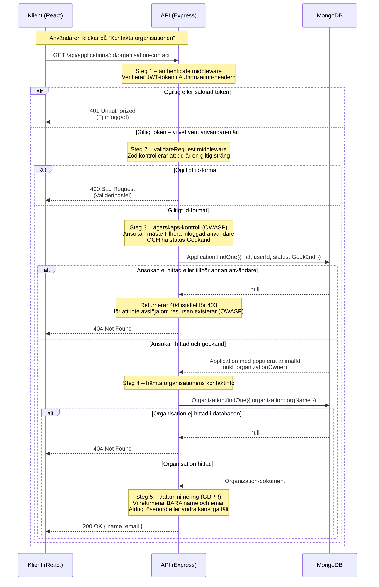

# Sekvensdiagram – Kontakta organisation efter godkänd adoption

Detta diagram visar hela flödet när en inloggad användare klickar på 
"Kontakta organisationen" i frontend. Varje steg är skyddat av säkerhetslager
som säkerställer att bara rätt användare får tillgång till kontaktuppgifterna.

## Säkerhetslager i ordning

1. **JWT-autentisering** – Vem är du? Token verifieras.
2. **Zod-validering** – Är anrops-id:t i rätt format?
3. **Ägarskaps-kontroll (OWASP)** – Är det din ansökan?
4. **Statuskontroll** – Är ansökan godkänd?
5. **Dataminimering (GDPR)** – Vi returnerar bara namn och email, inget annat.

## Varför 404 istället för 403?

Enligt OWASP ska vi returnera 404 när en användare försöker nå en resurs som 
inte är deras. Om vi returnerade 403 ("du har inte tillstånd") skulle det avslöja 
att resursen *existerar* — det är ett informationsläckage. Med 404 lär sig 
angriparen ingenting om systemet.

## Dataminimering

Enligt GDPR ska vi bara returnera den data som är absolut nödvändig. 
Därför returnerar endpointen bara `name` och `email` från organisationen — 
inte lösenord, roll eller andra fält som finns i databasen.